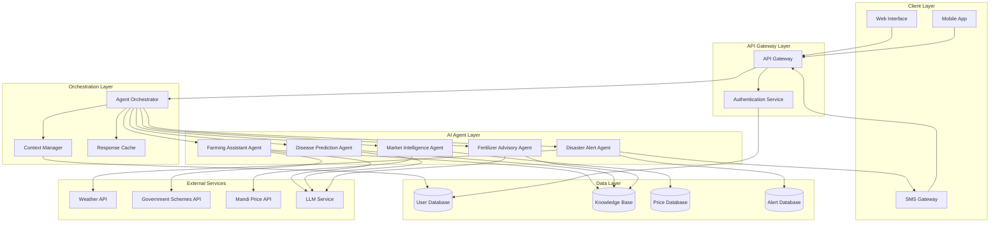

# Design Document: AI Krishi Mitra

## Overview

AI Krishi Mitra is a multi-agent AI platform that provides comprehensive agricultural guidance to farmers through five specialized AI agents. The system architecture follows a microservices pattern where each AI agent operates as an independent service, coordinated by a central orchestration layer. The platform emphasizes accessibility, supporting multiple regional languages, voice input, and offline functionality to serve farmers in diverse connectivity environments.

The system integrates with external data sources for weather monitoring, market prices, and government schemes, while maintaining a local knowledge base for crop diseases, fertilizer recommendations, and farming best practices. All farmer interactions are personalized based on their profile (location, crops, soil type) and historical context.

## Architecture

### High-Level Architecture



### Architectural Principles

1. **Agent Autonomy**: Each AI agent operates independently with its own domain knowledge and decision-making logic
2. **Loose Coupling**: Agents communicate through the orchestrator using standardized message formats
3. **Scalability**: Each agent can be scaled independently based on load patterns
4. **Resilience**: Failure of one agent does not affect others; graceful degradation is supported
5. **Offline-First**: Critical data is cached locally to support offline operation
6. **Multi-Tenancy**: The system supports multiple farmers with isolated data and personalized experiences

## Components and Interfaces

### 1. API Gateway

**Responsibility**: Entry point for all client requests, handles routing, rate limiting, and request validation.

**Interface**:
```typescript
interface APIGateway {
  // Route incoming requests to appropriate services
  routeRequest(request: HttpRequest): Promise<HttpResponse>
  
  // Validate authentication tokens
  validateAuth(token: string): Promise<AuthResult>
  
  // Apply rate limiting per user
  checkRateLimit(userId: string): Promise<boolean>
}
```

### 2. Authentication Service

**Responsibility**: Manages user registration, login, password reset, and session management.

**Interface**:
```typescript
interface AuthenticationService {
  // Register new farmer
  register(profile: FarmerProfile): Promise<AuthToken>
  
  // Authenticate farmer credentials
  login(credentials: Credentials): Promise<AuthToken>
  
  // Reset password via SMS/Email
  resetPassword(contact: string): Promise<ResetToken>
  
  // Validate session token
  validateToken(token: string): Promise<UserId>
}
```

### 3. Agent Orchestrator

**Responsibility**: Coordinates multiple AI agents, manages conversation context, and combines responses.

**Interface**:
```typescript
interface AgentOrchestrator {
  // Process farmer query and route to appropriate agent(s)
  processQuery(query: FarmerQuery, context: ConversationContext): Promise<AgentResponse>
  
  // Coordinate multi-agent responses
  coordinateAgents(query: FarmerQuery, agents: AgentType[]): Promise<UnifiedResponse>
  
  // Detect which agents are needed for a query
  detectRequiredAgents(query: FarmerQuery): AgentType[]
}
```

### 4. Farming Assistant Agent

**Responsibility**: Answers general farming queries about crops, soil, irrigation, seasonal practices, and government schemes.

**Interface**:
```typescript
interface FarmingAssistantAgent {
  // Process general farming query
  answerQuery(query: string, farmerContext: FarmerContext): Promise<FarmingAdvice>
  
  // Get government scheme information
  getGovernmentSchemes(location: Location, cropType: string): Promise<SchemeInfo[]>
  
  // Ask clarifying questions for ambiguous queries
  getClarification(query: string): Promise<ClarifyingQuestion[]>
}
```

### 5. Disease Prediction Agent

**Responsibility**: Analyzes crop images or symptom descriptions to identify diseases and recommend treatments.

**Interface**:
```typescript
interface DiseasePredictionAgent {
  // Analyze crop image for disease detection
  analyzeImage(image: CropImage): Promise<DiseasePrediction[]>
  
  // Analyze text symptoms for disease identification
  analyzeSymptoms(symptoms: string, cropType: string): Promise<DiseasePrediction[]>
  
  // Get treatment recommendations for identified disease
  getTreatment(disease: Disease, severity: number): Promise<TreatmentPlan>
  
  // Validate image quality
  validateImageQuality(image: CropImage): Promise<ImageQualityResult>
}
```

### 6. Fertilizer Advisory Agent

**Responsibility**: Provides fertilizer recommendations based on crop type, soil data, and cost optimization.

**Interface**:
```typescript
interface FertilizerAdvisoryAgent {
  // Generate fertilizer recommendation
  generateAdvisory(cropType: string, soilData: SoilData): Promise<FertilizerAdvisory>
  
  // Calculate input costs for recommendation
  calculateCosts(advisory: FertilizerAdvisory, location: Location): Promise<CostEstimate>
  
  // Estimate yield improvement
  estimateYieldImprovement(advisory: FertilizerAdvisory, baseline: number): Promise<YieldEstimate>
  
  // Validate soil data completeness
  validateSoilData(soilData: SoilData): Promise<ValidationResult>
}
```

### 7. Market Intelligence Agent

**Responsibility**: Provides mandi locations and current commodity prices to help farmers make selling decisions.

**Interface**:
```typescript
interface MarketIntelligenceAgent {
  // Find nearby mandis
  findNearbyMandis(location: Location, radius: number): Promise<MandiInfo[]>
  
  // Get current prices for commodity
  getCommodityPrices(commodity: string, mandis: string[]): Promise<PriceInfo[]>
  
  // Update price data from external sources
  updatePriceData(): Promise<UpdateResult>
}
```

### 8. Disaster Alert Agent

**Responsibility**: Monitors weather data, sends disaster alerts, and generates summary reports.

**Interface**:
```typescript
interface DisasterAlertAgent {
  // Monitor weather and evaluate disaster risk
  evaluateDisasterRisk(location: Location): Promise<RiskAssessment>
  
  // Send disaster alert via SMS and Email
  sendAlert(alert: DisasterAlert, farmers: FarmerId[]): Promise<SendResult>
  
  // Generate summary report for time period
  generateReport(farmerId: string, startDate: Date, endDate: Date): Promise<SummaryReport>
  
  // Prioritize multiple active alerts
  prioritizeAlerts(alerts: DisasterAlert[]): DisasterAlert[]
}
```

### 9. Context Manager

**Responsibility**: Maintains conversation context and farmer profile information across sessions.

**Interface**:
```typescript
interface ContextManager {
  // Get farmer context for personalization
  getFarmerContext(farmerId: string): Promise<FarmerContext>
  
  // Update conversation context
  updateContext(sessionId: string, interaction: Interaction): Promise<void>
  
  // Get conversation history
  getHistory(sessionId: string, limit: number): Promise<Interaction[]>
}
```

### 10. Response Cache

**Responsibility**: Caches responses for offline access and performance optimization.

**Interface**:
```typescript
interface ResponseCache {
  // Cache response for offline access
  cacheResponse(key: string, response: any, ttl: number): Promise<void>
  
  // Retrieve cached response
  getCache(key: string): Promise<any | null>
  
  // Sync offline queries when online
  syncOfflineQueries(queries: OfflineQuery[]): Promise<SyncResult>
}
```

## Data Models

### FarmerProfile
```typescript
interface FarmerProfile {
  id: string
  name: string
  phoneNumber: string
  email?: string
  location: Location
  primaryCrops: string[]
  landSize: number // in acres
  soilType?: string
  preferredLanguage: string
  registrationDate: Date
  lastLogin: Date
}
```

### Location
```typescript
interface Location {
  latitude: number
  longitude: number
  district: string
  state: string
  pincode: string
}
```

### FarmerQuery
```typescript
interface FarmerQuery {
  farmerId: string
  sessionId: string
  queryText: string
  queryType: 'text' | 'voice' | 'image'
  language: string
  timestamp: Date
  metadata?: Record<string, any>
}
```

### DiseasePrediction
```typescript
interface DiseasePrediction {
  diseaseName: string
  confidence: number // 0-100
  severity: 'low' | 'medium' | 'high'
  affectedParts: string[]
  description: string
  treatment: TreatmentPlan
}
```

### TreatmentPlan
```typescript
interface TreatmentPlan {
  steps: TreatmentStep[]
  estimatedCost: number
  timeToRecovery: string
  preventiveMeasures: string[]
}
```

### TreatmentStep
```typescript
interface TreatmentStep {
  stepNumber: number
  action: string
  materials: string[]
  timing: string
  precautions: string[]
}
```

### FertilizerAdvisory
```typescript
interface FertilizerAdvisory {
  cropType: string
  soilType: string
  recommendations: FertilizerRecommendation[]
  applicationSchedule: ApplicationSchedule[]
  estimatedCost: number
  expectedYieldIncrease: number // percentage
  notes: string[]
}
```

### FertilizerRecommendation
```typescript
interface FertilizerRecommendation {
  fertilizerType: string
  composition: NutrientComposition
  quantityPerAcre: number
  applicationMethod: string
  costPerUnit: number
}
```

### NutrientComposition
```typescript
interface NutrientComposition {
  nitrogen: number // percentage
  phosphorus: number // percentage
  potassium: number // percentage
  micronutrients?: Record<string, number>
}
```

### MandiInfo
```typescript
interface MandiInfo {
  id: string
  name: string
  location: Location
  distance: number // in kilometers
  operatingHours: string
  contactNumber?: string
  facilities: string[]
}
```

### PriceInfo
```typescript
interface PriceInfo {
  mandiId: string
  mandiName: string
  commodity: string
  price: number // per quintal
  unit: string
  lastUpdated: Date
  trend: 'up' | 'down' | 'stable'
}
```

### DisasterAlert
```typescript
interface DisasterAlert {
  id: string
  type: 'flood' | 'drought' | 'cyclone' | 'hailstorm' | 'frost' | 'heatwave'
  severity: 'low' | 'medium' | 'high' | 'critical'
  location: Location
  affectedRadius: number // in kilometers
  expectedTime: Date
  duration: string
  description: string
  protectiveActions: string[]
  issuedAt: Date
}
```

### SoilData
```typescript
interface SoilData {
  soilType: string
  pH: number
  organicCarbon: number // percentage
  nitrogen: number // kg/ha
  phosphorus: number // kg/ha
  potassium: number // kg/ha
  moisture: number // percentage
  testDate?: Date
}
```

### ConversationContext
```typescript
interface ConversationContext {
  sessionId: string
  farmerId: string
  farmerProfile: FarmerProfile
  conversationHistory: Interaction[]
  activeAgents: AgentType[]
  lastInteractionTime: Date
}
```

### Interaction
```typescript
interface Interaction {
  timestamp: Date
  query: string
  response: string
  agentType: AgentType
  metadata?: Record<string, any>
}
```

### AgentType
```typescript
type AgentType = 
  | 'farming_assistant'
  | 'disease_prediction'
  | 'fertilizer_advisory'
  | 'market_intelligence'
  | 'disaster_alert'
```

## Correctness Properties

*A property is a characteristic or behavior that should hold true across all valid executions of a system—essentially, a formal statement about what the system should do. Properties serve as the bridge between human-readable specifications and machine-verifiable correctness guarantees.*

