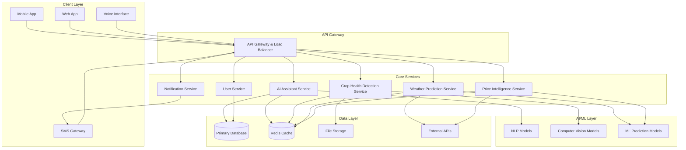

# Design Document: AI Krishi Mitra

## Overview

AI Krishi Mitra is a comprehensive AI-powered platform designed to support sustainable and resilient rural farming practices. The system architecture follows a microservices approach with mobile-first design, ensuring scalability, reliability, and accessibility for farmers in rural areas with varying connectivity conditions.

The platform integrates three core AI capabilities:
1. **Multilingual Conversational AI** for agricultural guidance and education
2. **Computer Vision AI** for crop health detection and diagnosis
3. **Predictive AI** for weather disaster forecasting and market intelligence

The system is designed to operate across multiple channels (mobile app, web, SMS, voice) with robust offline capabilities and seamless data synchronization.

## Architecture

### High-Level Architecture



### Service Architecture

The system follows a microservices architecture with the following key services:

1. **AI Assistant Service**: Handles multilingual conversations, query processing, and response generation
2. **Crop Health Detection Service**: Processes images and provides crop health analysis
3. **Weather Prediction Service**: Analyzes weather data and generates disaster predictions
4. **Price Intelligence Service**: Aggregates mandi prices and provides recommendations
5. **User Service**: Manages user authentication, profiles, and preferences
6. **Notification Service**: Handles SMS, push notifications, and alerts

## Components and Interfaces

### AI Assistant Service

**Responsibilities:**
- Process natural language queries in multiple Indian languages
- Maintain conversation context and history
- Integrate with knowledge base for agricultural guidance
- Coordinate with other services for comprehensive responses

**Key Interfaces:**
```typescript
interface AIAssistantService {
  processQuery(query: Query): Promise<Response>
  processVoiceInput(audio: AudioData): Promise<Response>
  getConversationHistory(userId: string): Promise<Conversation[]>
  updateKnowledgeBase(content: KnowledgeContent): Promise<void>
}

interface Query {
  userId: string
  text: string
  language: SupportedLanguage
  context?: ConversationContext
  location?: GeoLocation
}

interface Response {
  text: string
  audio?: AudioData
  language: SupportedLanguage
  confidence: number
  followUpSuggestions?: string[]
}
```

### Crop Health Detection Service

**Responsibilities:**
- Analyze crop images for disease detection
- Provide treatment recommendations
- Maintain crop health database
- Support offline model deployment

**Key Interfaces:**
```typescript
interface CropHealthService {
  analyzeImage(image: ImageData, metadata: ImageMetadata): Promise<HealthAnalysis>
  getRecommendations(analysis: HealthAnalysis, language: SupportedLanguage): Promise<Treatment[]>
  updateModel(modelData: MLModel): Promise<void>
}

interface ImageData {
  buffer: Buffer
  format: ImageFormat
  resolution: Resolution
  timestamp: Date
}

interface HealthAnalysis {
  cropType: CropType
  healthStatus: HealthStatus
  diseases: Disease[]
  confidence: number
  severity: SeverityLevel
}

interface Treatment {
  disease: Disease
  recommendations: string[]
  preventiveMeasures: string[]
  organicAlternatives?: string[]
}
```

### Weather Prediction Service

**Responsibilities:**
- Collect and analyze weather data from multiple sources
- Generate disaster predictions with confidence levels
- Provide location-specific forecasts
- Trigger alert notifications

**Key Interfaces:**
```typescript
interface WeatherService {
  getPrediction(location: GeoLocation, timeframe: TimeFrame): Promise<WeatherPrediction>
  getDisasterAlerts(location: GeoLocation): Promise<DisasterAlert[]>
  updateWeatherData(data: WeatherData[]): Promise<void>
}

interface WeatherPrediction {
  location: GeoLocation
  forecast: WeatherForecast[]
  disasters: PotentialDisaster[]
  confidence: number
  lastUpdated: Date
}

interface DisasterAlert {
  type: DisasterType
  severity: SeverityLevel
  probability: number
  timeframe: TimeFrame
  recommendations: string[]
  affectedAreas: GeoLocation[]
}
```

### Price Intelligence Service

**Responsibilities:**
- Aggregate mandi price data using MCP protocols
- Provide price comparisons and recommendations
- Generate price trend analysis
- Cache frequently requested price data

**Key Interfaces:**
```typescript
interface PriceIntelligenceService {
  getCurrentPrices(crop: CropType, location: GeoLocation): Promise<MandiPrice[]>
  getPriceTrends(crop: CropType, timeframe: TimeFrame): Promise<PriceTrend>
  getRecommendations(crop: CropType, quantity: number, location: GeoLocation): Promise<SaleRecommendation[]>
  updatePriceData(): Promise<void>
}

interface MandiPrice {
  mandiName: string
  location: GeoLocation
  crop: CropType
  price: number
  quality: QualityGrade
  distance: number
  lastUpdated: Date
}

interface SaleRecommendation {
  mandi: MandiPrice
  expectedRevenue: number
  transportCost: number
  netProfit: number
  ranking: number
}
```

## Data Models

### Core Entities

```typescript
// User Management
interface Farmer {
  id: string
  phoneNumber: string
  name: string
  location: GeoLocation
  crops: CropType[]
  preferredLanguage: SupportedLanguage
  landSize: number
  registrationDate: Date
  isVerified: boolean
}

interface GeoLocation {
  latitude: number
  longitude: number
  district: string
  state: string
  pincode: string
}

// Agricultural Data
interface CropType {
  id: string
  name: string
  localNames: Map<SupportedLanguage, string>
  season: Season
  growthPeriod: number
  commonDiseases: Disease[]
}

interface Disease {
  id: string
  name: string
  symptoms: string[]
  causes: string[]
  treatments: Treatment[]
  severity: SeverityLevel
}

// Weather and Alerts
interface WeatherData {
  location: GeoLocation
  temperature: TemperatureRange
  humidity: number
  rainfall: number
  windSpeed: number
  pressure: number
  timestamp: Date
}

interface DisasterType {
  DROUGHT: 'drought'
  FLOOD: 'flood'
  CYCLONE: 'cyclone'
  HAILSTORM: 'hailstorm'
  FROST: 'frost'
  PEST_OUTBREAK: 'pest_outbreak'
}

// Market Data
interface MandiData {
  id: string
  name: string
  location: GeoLocation
  operatingHours: TimeRange
  supportedCrops: CropType[]
  facilities: MarketFacility[]
}

// System Configuration
interface SupportedLanguage {
  HINDI: 'hi'
  ENGLISH: 'en'
  BENGALI: 'bn'
  TAMIL: 'ta'
  TELUGU: 'te'
  MARATHI: 'mr'
  GUJARATI: 'gu'
  KANNADA: 'kn'
  MALAYALAM: 'ml'
  PUNJABI: 'pa'
}
```

### Database Schema

```sql
-- Users and Authentication
CREATE TABLE farmers (
    id UUID PRIMARY KEY,
    phone_number VARCHAR(15) UNIQUE NOT NULL,
    name VARCHAR(100),
    latitude DECIMAL(10, 8),
    longitude DECIMAL(11, 8),
    district VARCHAR(50),
    state VARCHAR(50),
    pincode VARCHAR(10),
    preferred_language VARCHAR(5),
    land_size DECIMAL(8, 2),
    created_at TIMESTAMP DEFAULT CURRENT_TIMESTAMP,
    updated_at TIMESTAMP DEFAULT CURRENT_TIMESTAMP,
    is_verified BOOLEAN DEFAULT FALSE
);

-- Crop and Agricultural Data
CREATE TABLE crops (
    id UUID PRIMARY KEY,
    name VARCHAR(100) NOT NULL,
    season VARCHAR(20),
    growth_period_days INTEGER,
    created_at TIMESTAMP DEFAULT CURRENT_TIMESTAMP
);

CREATE TABLE farmer_crops (
    farmer_id UUID REFERENCES farmers(id),
    crop_id UUID REFERENCES crops(id),
    area_hectares DECIMAL(8, 2),
    planting_date DATE,
    PRIMARY KEY (farmer_id, crop_id)
);

-- Conversations and Interactions
CREATE TABLE conversations (
    id UUID PRIMARY KEY,
    farmer_id UUID REFERENCES farmers(id),
    query_text TEXT,
    response_text TEXT,
    language VARCHAR(5),
    confidence_score DECIMAL(3, 2),
    created_at TIMESTAMP DEFAULT CURRENT_TIMESTAMP
);

-- Image Analysis
CREATE TABLE crop_images (
    id UUID PRIMARY KEY,
    farmer_id UUID REFERENCES farmers(id),
    image_url VARCHAR(500),
    crop_type VARCHAR(50),
    analysis_result JSONB,
    confidence_score DECIMAL(3, 2),
    created_at TIMESTAMP DEFAULT CURRENT_TIMESTAMP
);

-- Weather and Alerts
CREATE TABLE weather_alerts (
    id UUID PRIMARY KEY,
    alert_type VARCHAR(50),
    severity VARCHAR(20),
    probability DECIMAL(3, 2),
    affected_districts TEXT[],
    message TEXT,
    recommendations TEXT,
    valid_from TIMESTAMP,
    valid_until TIMESTAMP,
    created_at TIMESTAMP DEFAULT CURRENT_TIMESTAMP
);

-- Market Prices
CREATE TABLE mandi_prices (
    id UUID PRIMARY KEY,
    mandi_name VARCHAR(100),
    location_district VARCHAR(50),
    location_state VARCHAR(50),
    crop_type VARCHAR(50),
    price_per_quintal DECIMAL(10, 2),
    quality_grade VARCHAR(20),
    recorded_date DATE,
    created_at TIMESTAMP DEFAULT CURRENT_TIMESTAMP
);
```

## Correctness Properties

*A property is a characteristic or behavior that should hold true across all valid executions of a system—essentially, a formal statement about what the system should do. Properties serve as the bridge between human-readable specifications and machine-verifiable correctness guarantees.*

Before defining the correctness properties, let me analyze the acceptance criteria from the requirements to determine which ones are testable as properties.

<function_calls>
<invoke name="prework">
<parameter name="featureName">ai-krishi-mitra

### Property Reflection

After analyzing all acceptance criteria, I identified several areas where properties can be consolidated to eliminate redundancy:

**Language Support Consolidation**: Properties 1.1 and 1.2 both test minimum language support and can be combined into a single comprehensive property.

**Alert Delivery Consolidation**: Properties 3.2 and 3.3 both test alert delivery mechanisms and can be combined into one property covering all notification channels.

**Performance Consolidation**: Properties 2.1 and 8.2 both test response time requirements and can be addressed by a single comprehensive performance property.

**Data Security Consolidation**: Properties 7.1, 7.2, and 7.5 all relate to data security and can be combined into comprehensive security properties.

Based on this reflection, the following properties provide unique validation value without redundancy:

### Core Correctness Properties

**Property 1: Multilingual Support Completeness**
*For any* supported feature (voice, text, recommendations), the system should support at least 5 major Indian regional languages consistently across all interaction modes
**Validates: Requirements 1.1, 1.2**

**Property 2: Agricultural Query Relevance**
*For any* agricultural question submitted by a farmer, the AI Assistant should provide responses that are contextually relevant to farming practices and crop management
**Validates: Requirements 1.3**

**Property 3: Image Analysis Completeness**
*For any* valid crop image submitted, the Crop Health Detector should provide a complete health assessment including crop type identification, health status, and confidence score
**Validates: Requirements 1.4**

**Property 4: Conversation Context Preservation**
*For any* sequence of interactions within a session, the AI Assistant should maintain conversation context and reference previous exchanges appropriately
**Validates: Requirements 1.5**

**Property 5: System Performance Consistency**
*For any* user request under normal load conditions, the system should respond within the specified time limits (30 seconds for image analysis, 3 seconds for text queries)
**Validates: Requirements 2.1, 8.2**

**Property 6: Disease Detection Accuracy**
*For any* crop image in the test dataset, the Crop Health Detector should achieve at least 85% accuracy in disease identification
**Validates: Requirements 2.2**

**Property 7: Language-Consistent Recommendations**
*For any* detected crop issue, treatment recommendations should be provided in the farmer's preferred language as specified in their profile
**Validates: Requirements 2.3**

**Property 8: Image Resolution Support**
*For any* image with minimum 2MP resolution from mobile cameras, the Crop Health Detector should successfully process and analyze the image
**Validates: Requirements 2.4**

**Property 9: Quality Validation Error Handling**
*For any* image with insufficient quality, the system should reject the analysis and provide specific guidance for image improvement
**Validates: Requirements 2.5**

**Property 10: Weather Prediction Timeliness**
*For any* weather analysis, disaster predictions should be generated with a 72-hour advance timeframe and include probability scores with confidence levels
**Validates: Requirements 3.1, 3.4**

**Property 11: Comprehensive Alert Delivery**
*For any* predicted weather disaster, the Alert System should deliver notifications through all available channels (SMS, push notifications) to registered users in the affected area
**Validates: Requirements 3.2, 3.3**

**Property 12: Alert Content Completeness**
*For any* weather alert sent to farmers, the message should include actionable recommendations for crop protection specific to the predicted disaster type
**Validates: Requirements 3.5**

**Property 13: MCP Protocol Compliance**
*For any* price data request, the Price Intelligence service should access mandi data using MCP protocols and return current market information
**Validates: Requirements 4.1**

**Property 14: Location-Based Price Filtering**
*For any* crop price query with location data, the system should return only mandi prices within a 50km radius of the farmer's location
**Validates: Requirements 4.2**

**Property 15: Price Ranking Accuracy**
*For any* set of mandi prices, the ranking algorithm should order results by optimal combination of price and distance to maximize farmer profit
**Validates: Requirements 4.3**

**Property 16: Price Trend Completeness**
*For any* crop price analysis request, the system should provide trend data covering the past 30 days or indicate when insufficient historical data exists
**Validates: Requirements 4.4**

**Property 17: Price Estimation Fallback**
*For any* price query when real-time data is unavailable, the system should provide estimated prices based on historical trends and clearly indicate the estimation
**Validates: Requirements 4.5**

**Property 18: Registration Data Completeness**
*For any* farmer registration process, the system should collect and validate all required information (phone number, location, crop types, language preferences)
**Validates: Requirements 5.1, 5.2, 5.3**

**Property 19: Profile Update Flexibility**
*For any* farmer profile modification request, the system should allow updates to all profile fields while maintaining data integrity and validation
**Validates: Requirements 5.4**

**Property 20: Privacy Protection Enforcement**
*For any* data sharing operation, the system should verify explicit user consent before sharing personal information with external parties
**Validates: Requirements 5.5**

**Property 21: Offline Data Availability**
*For any* frequently accessed content (FAQs, crop models, weather alerts), the system should maintain offline copies and indicate when internet connectivity is required
**Validates: Requirements 6.1, 6.2, 6.4, 6.5**

**Property 22: Data Synchronization Consistency**
*For any* offline interaction, when connectivity is restored, the system should sync all local changes with the cloud without data loss or conflicts
**Validates: Requirements 6.3**

**Property 23: Comprehensive Data Security**
*For any* farmer data (personal information, images, conversations), the system should apply encryption in transit and at rest, implement role-based access control, and provide data export capabilities
**Validates: Requirements 7.1, 7.2, 7.5**

**Property 24: Data Deletion Compliance**
*For any* account deletion request, the system should permanently remove all personal data within 30 days and provide confirmation of deletion
**Validates: Requirements 7.3**

**Property 25: System Scalability and Reliability**
*For any* system load up to 10,000 concurrent users, the system should maintain performance standards and gracefully degrade non-critical features when capacity is exceeded
**Validates: Requirements 8.1, 8.5**

**Property 26: Weather Data Processing Consistency**
*For any* 6-hour interval, the Weather Predictor should process updated weather data and maintain 99.5% uptime during peak farming seasons
**Validates: Requirements 8.3, 8.4**

## Error Handling

### Error Categories and Strategies

**1. Input Validation Errors**
- Invalid image formats or corrupted files
- Malformed text queries or unsupported languages
- Invalid location coordinates or missing profile data
- Strategy: Immediate validation with user-friendly error messages and correction guidance

**2. External Service Failures**
- Weather API unavailability or timeout
- MCP protocol connection failures
- SMS gateway service disruptions
- Strategy: Graceful degradation with cached data, retry mechanisms, and alternative service providers

**3. AI/ML Model Errors**
- Low confidence predictions below threshold
- Model inference failures or timeouts
- Unsupported crop types or disease categories
- Strategy: Fallback to rule-based systems, human expert escalation, and confidence score transparency

**4. System Resource Errors**
- Database connection failures
- Memory or storage limitations
- Network connectivity issues
- Strategy: Circuit breaker patterns, resource pooling, and automatic scaling

**5. Authentication and Authorization Errors**
- Invalid OTP or expired tokens
- Insufficient permissions for requested operations
- Account suspension or deactivation
- Strategy: Clear error messages, secure token refresh, and proper access control enforcement

### Error Response Format

```typescript
interface ErrorResponse {
  error: {
    code: string
    message: string
    details?: any
    timestamp: Date
    requestId: string
    suggestions?: string[]
  }
}

// Example error responses
const IMAGE_QUALITY_ERROR = {
  code: 'IMAGE_QUALITY_INSUFFICIENT',
  message: 'Image quality is too low for accurate analysis',
  suggestions: [
    'Ensure good lighting conditions',
    'Hold camera steady and focus on the crop',
    'Take photo from 1-2 feet distance'
  ]
}

const WEATHER_SERVICE_ERROR = {
  code: 'WEATHER_DATA_UNAVAILABLE',
  message: 'Weather service temporarily unavailable',
  details: 'Using cached data from 2 hours ago',
  suggestions: ['Try again in a few minutes for latest data']
}
```

## Testing Strategy

### Dual Testing Approach

The AI Krishi Mitra system requires comprehensive testing using both unit tests and property-based tests to ensure correctness, reliability, and performance across all components.

**Unit Testing Focus:**
- Specific examples of agricultural queries and expected responses
- Edge cases for image processing (very small/large files, unusual formats)
- Error conditions and exception handling
- Integration points between microservices
- Authentication and authorization workflows
- Database operations and data validation

**Property-Based Testing Focus:**
- Universal properties that hold for all valid inputs
- Comprehensive input coverage through randomization
- System behavior under various load conditions
- Data consistency across service boundaries
- Security properties across all user interactions

### Property-Based Testing Configuration

**Testing Framework:** We will use **Hypothesis** for Python services and **fast-check** for TypeScript/JavaScript components.

**Test Configuration:**
- Minimum 100 iterations per property test to ensure statistical significance
- Each property test must reference its corresponding design document property
- Tag format: **Feature: ai-krishi-mitra, Property {number}: {property_text}**

**Example Property Test Structure:**
```python
from hypothesis import given, strategies as st
import pytest

@given(
    query=st.text(min_size=1, max_size=500),
    language=st.sampled_from(['hi', 'en', 'bn', 'ta', 'te'])
)
def test_agricultural_query_relevance(query, language):
    """
    Feature: ai-krishi-mitra, Property 2: Agricultural Query Relevance
    For any agricultural question, AI Assistant should provide relevant responses
    """
    # Test implementation
    response = ai_assistant.process_query(query, language)
    assert response.confidence > 0.7
    assert is_agriculture_related(response.text)
    assert response.language == language

@given(
    image_data=st.binary(min_size=1024, max_size=10*1024*1024),
    resolution=st.integers(min_value=2, max_value=50)
)
def test_image_analysis_completeness(image_data, resolution):
    """
    Feature: ai-krishi-mitra, Property 3: Image Analysis Completeness
    For any valid crop image, system should provide complete health assessment
    """
    # Test implementation
    analysis = crop_health_detector.analyze_image(image_data, resolution)
    assert analysis.crop_type is not None
    assert analysis.health_status is not None
    assert 0 <= analysis.confidence <= 1
```

### Integration Testing

**Service Integration Tests:**
- End-to-end workflows across multiple services
- Data flow validation from user input to final response
- External API integration reliability
- Database transaction consistency

**Performance Testing:**
- Load testing with up to 10,000 concurrent users
- Response time validation under various load conditions
- Memory and resource usage monitoring
- Scalability testing for individual microservices

**Security Testing:**
- Authentication and authorization validation
- Data encryption verification
- Input sanitization and injection prevention
- Privacy compliance verification

### Test Data Management

**Synthetic Data Generation:**
- Crop image datasets with known disease classifications
- Multilingual agricultural query datasets
- Weather pattern data for disaster prediction testing
- Mandi price historical data for trend analysis

**Test Environment Setup:**
- Isolated test databases with representative data
- Mock external services for reliable testing
- Containerized test environments for consistency
- Automated test data refresh and cleanup

This comprehensive testing strategy ensures that the AI Krishi Mitra system meets all functional requirements while maintaining high performance, security, and reliability standards for rural farming communities.